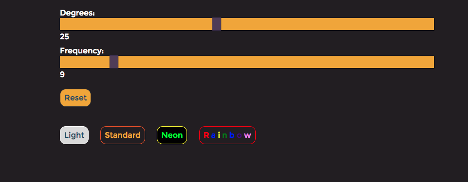

# Cine-Reel

[Live Project](https://loschtreality.github.io/Cine-Reel/)

A visual representation of Michael Bach's Color Wheel Illusion

## Background

Michael Bach's color wheel illusion shows us how our eyes can deceive us when looking at objects with a fast rotation. A wheel of dots is placed, each dot level has 12 dots separated by 30 degrees (360 degrees total). There are 5 dot layers to the wheel. A trail of color dots is made, called the tail, which is one dot colored and staggered with its parent at the higher level. The rotates at 9 times per second by 25 degrees to the left.  At this speed and rotation, this gives us the illusion that the dots are spinning one way, while the trail spins the other. But what happens when we increase or decrease the frequency (number of rotations) or the degrees by which it rotates?

## Features and Implementation

The Reel has an initial state of rotating at 25 degrees with a freqency of 9 hz


These are the controls which handle the degrees of rotation and frequency of the reel:



Users can change the frequency and degrees using the sliders and change the color scheme of the wheel with the buttons

## Architecture and Technologies

D3.js was used for the placement of elements on the SVG object. Each ring of circles was dynamically created using a loop and the D3 attribute setter:

```js
let origin = {
  cx: 250,
  cy: 450,
  r: 40
};

const makeCircle = (originDist, offSet, cirRadius) => {
  let newOriginX = origin.cx + ((originDist) * Math.sin(offSet * (Math.PI/180)));
  let newOriginY = origin.cy - ((originDist) * Math.cos(offSet * (Math.PI/180)));

  let cir_group = svg.select("g").append("g").classed("cir-group",true);


  for (var angle = 0; angle < 360; angle += 30) {
    cir_group.append("circle")
    .attr("cx", newOriginX)
    .attr("cy", newOriginY)
    .attr("r", cirRadius)
    .attr("transform",`rotate(${angle}, ${origin.cx}, ${origin.cy})`)
    .classed((angle === 0 ? "tail" : "normal"), true);
  }
}
```


## Future Improvements

The color wagon wheel can be updated with a few future options:

- [ ] Ability for users to click which dots they'd like to color

- [ ] Shape shifting toggle from circles to squares

- [ ] Add image to SVG and show pieces of the image with dots
