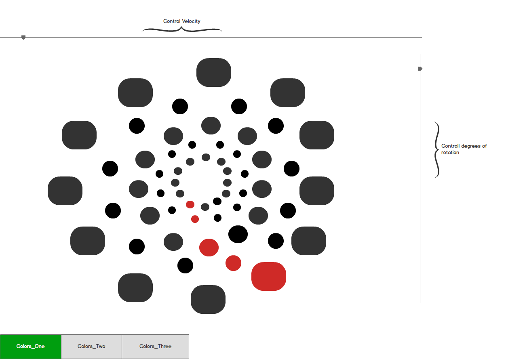

# Color Wheel Illusion
A visual representation of Michael Bach's color wheel illusion

## Background

Michael Bach's color wheel illusion shows us how our eyes can deceive us when looking at objects with a fast rotation. A wheel of dots is placed, each dot level has 12 dots separated by 30 degrees (360 degrees total). There are 5 dot layers to the wheel. A trail of color dots is made, called the tail, which is one dot colored and staggered with its parent at the higher level. The rotates at 9 times per second by 25 degrees to the right.  At this speed and rotation, this gives us the illusion that the dots are spinning one way, while the trail spins the other. But what happens when we increase or decrease the frequency (number of rotations) or the degrees by which it rotates?

## Functionality & MVP

With this interactive color wagon wheel, users will be able to:

- [ ] Change the frequency and degrees of rotation of the wheel
- [ ] Choose from preset demo initial states
- [ ] Reset the wheel to its original state
- [ ] Toggle between color schemes for different visibility

## Architecture and Technologies

This project will be created with:

- D3.js library for the visualizatons and functionality of the wheel
- SCSS for color schemes and the ability to switch between schemes

## Wireframe

## Implementation Timeline

**Day 1**: Create D3.js environment and learn to place objects on the SVG object.

**Day 2**: Learn transitional manipulation in D3 and implement it to create wheel rotation. Add user controls for interactivity

**Day 3**: Add color schemes for user to interact with. Add additional styling for a professional look

## Bonus Features

The color wagon wheel can be updated with a few future options:

- [ ] Ability for users to click which dots they'd like to color

- [ ] Shape shifting toggle from circles to squares
